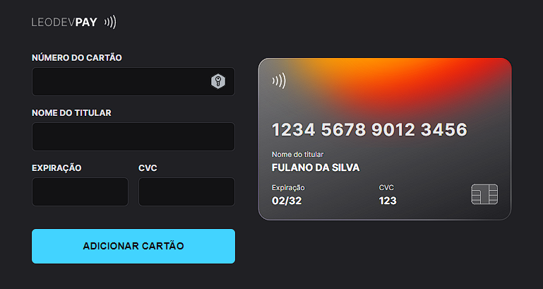

<h1 align="center"> Cartão DEVLEOPAY </h1>

  <a href="#-tecnologias">Tecnologias</a>&nbsp;&nbsp;&nbsp;|&nbsp;&nbsp;&nbsp;
  <a href="#-projeto">Projeto</a>&nbsp;&nbsp;&nbsp;|&nbsp;&nbsp;&nbsp;
  <a href="#memo-licença">Licença</a>

  

 

  

## 🚀 Tecnologias

Esse projeto foi desenvolvido com as seguintes tecnologias:

- HTML e CSS
- JavaScript e JSON
- [Node e NPM](https://nodejs.org/)
- [Vite](https://vitejs.dev/)
- [iMask](https://imask.js.org)

## 💻 Projeto

O LEODEVPAY é um componente que simula o formulário de preenchimento de cartão de crédito, onde é possível adicionar máscara aos inputs e atualizar elementos HTML via DOM.

## :memo: Licença

Esse projeto está sob a licença MIT.

---
